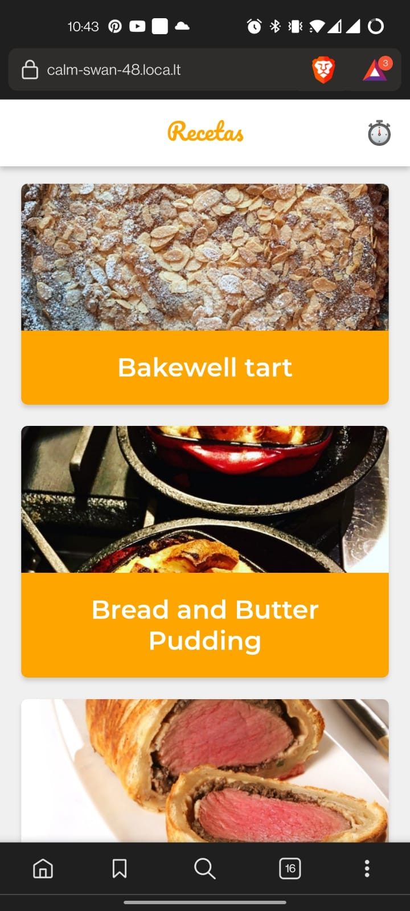

# Aplicación de recetas

PWA que utiliza la API de MealDB para mostrar recetas con sus instrucciones. Algunas de las features que tiene son:
* Soporte offline con workbox
* Estrategías de red apropiadas para los recursos
* Home Screen
* Web Share API
* SplashScreen

## Scripts

* `npm install` para instalar las dependencias
* `npm run dev` para entorno de desarrollo 
* `npm run build && npm start` para producción

## Licencia 
MIT

# Creada con React
